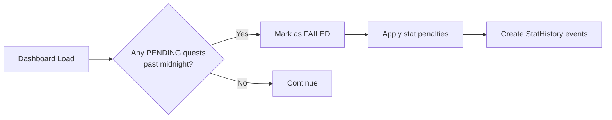

# Architecture Overview

## App Structure

FitTrack uses Next.js 16 with the **App Router**. Routes are organized as follows:

### Route Groups

- **`(dashboard)/`** — Authenticated pages wrapped in a shared layout (nav bar, mobile tab bar). Redirects unauthenticated users to `/login` and users who haven't completed onboarding to `/onboarding`.
- **`login/`, `signup/`, `onboarding/`** — Public, unauthenticated pages.

### Data Flow

```
Browser → Next.js Server → Server Component fetches data (Prisma)
                          → Renders HTML + streams client components
                          → Client components hydrate & handle interactions
                          → Client fetches API routes for mutations
                          → API routes validate (Zod) → mutate DB → respond JSON
                          → Client refreshes server components via router.refresh()
```

### Authentication

- **Provider**: NextAuth v5 with Credentials (email + password)
- **Session Strategy**: JWT (no database sessions)
- **Password Hashing**: bcryptjs (10 rounds)
- **Middleware**: Pages under `(dashboard)` are protected — unauthenticated users are redirected to `/login`

### State Management

No global state library. The app uses:
- **Server Components** for initial data fetching (Prisma queries)
- **Client Components** (`"use client"`) for interactive widgets
- **`router.refresh()`** to re-fetch server component data after mutations
- **Local `useState`** for form state and UI toggling

---

## Key Patterns

### PRPL Pattern (Prefetch, Render, Preload, Lazy)

- **Prefetch**: Next.js automatically prefetches `<Link>` targets in viewport
- **Instant Navigation**: View Transitions enable animated page transitions
- **Skeleton Loading**: Each authenticated page has a `loading.tsx` with shimmer skeletons
- **Lazy Components**: `DailyQuests` and `AiSuggestion` are client components that fetch their own data

### The Quest Sweep

The quest sweep runs on every dashboard load (`layout.tsx`) and via a cron endpoint:



### Stat Calculation

```
Hunter Level = round(average of all 8 stat values)
Rank:
  ≤ 20 → E   21–35 → D   36–50 → C
  51–65 → B  66–80 → A   81+ → S
```
