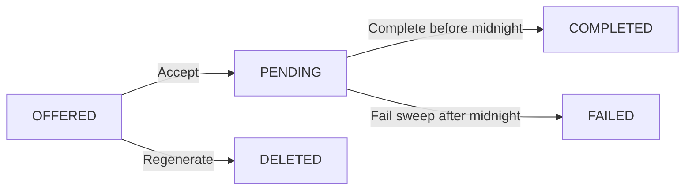

# Quest & Stat System

## The 8 Hunter Stats

| Code | Stat | Description |
|------|------|-------------|
| STR | Strength | Raw physical power |
| END | Endurance | Cardiovascular stamina |
| AGI | Agility | Quickness and coordination |
| SPD | Speed | Sprint and acceleration |
| PWR | Power | Explosive force (strength × speed) |
| FLX | Flexibility | Range of motion |
| VIT | Vitality | Recovery and resilience |
| DSC | Discipline | Training consistency |

Each stat has a value from **0–100**. The initial values are set during onboarding (12–38 range based on answers, with missing stats defaulting to 15).

## Hunter Level & Rank

```
Level = round(average of all 8 stats)

Rank thresholds:
  ≤ 20  → E (Novice)
  21–35 → D (Initiate)
  36–50 → C (Hunter)
  51–65 → B (Elite)
  66–80 → A (Master)
  81+   → S (Grand Master)
```

## Quest Lifecycle



### 1. OFFERED (Available)
Quests are generated daily via:
- **AI generation** (Groq Llama 3.3 70B) — analyzes weakest stats, recent sessions, and active goals to create 3 personalized quests
- **Manual creation** — user picks title, description, target, and stat rewards (max 3 stats)

### 2. PENDING (Accepted)
User accepts a quest. The quest must be completed before midnight UTC or it will be marked as failed.

### 3. COMPLETED
When marked complete:
- Stat values are incremented by each reward's `completionValue`
- A `StatHistory` entry is created for each reward with the reason and delta
- The stat gains are reflected immediately in the radar chart and level/rank

### 4. FAILED
When the quest failure sweep runs (on dashboard load or cron):
- Stat values are decremented by each reward's `failurePenalty`
- A `StatHistory` entry is created with a negative delta
- Gains and penalties follow a **3:1 ratio** (+3 on complete, -1 on fail)

## Stat Gain Sources

| Source | Stats Affected | Typical Gain |
|--------|---------------|--------------|
| Quest completion | Per quest rewards | +2 to +5 per stat |
| Quest failure | Per quest rewards | -1 to -2 per stat |
| Session stat boost | User-defined | +1 to +3 per stat |
| Onboarding | All 8 stats | 12–38 initial values |

## The Quest Sweep

The sweep runs in two places:

1. **Synchronous on dashboard load** — `runQuestFailureSweep(userId)` is called in the dashboard layout for the current user
2. **Cron job** — `GET /api/cron/quest-sweep` (protected) runs for all users

The sweep:
1. Finds all quests with status `PENDING` and date before today's UTC midnight
2. Updates their status to `FAILED` and sets `resolvedAt`
3. Decrements stats by the failure penalty amounts
4. Creates `StatHistory` entries for each penalty
5. All mutations run in a single Prisma transaction

## AI Generation Prompt

The AI is prompted as "The System" — a Solo Leveling-inspired fitness AI. It receives:
- Current sorted stats (weakest first)
- Last 7 days of training sessions
- Active goals with target dates

And generates quests that:
- Prioritize the weakest 2–3 stats
- Include recovery/light quests if recent RPE is high (7+)
- Are specific and completable in one session
- Scale difficulty with reward size (harder = bigger reward)
- Maintain a 3:1 gain/penalty ratio
